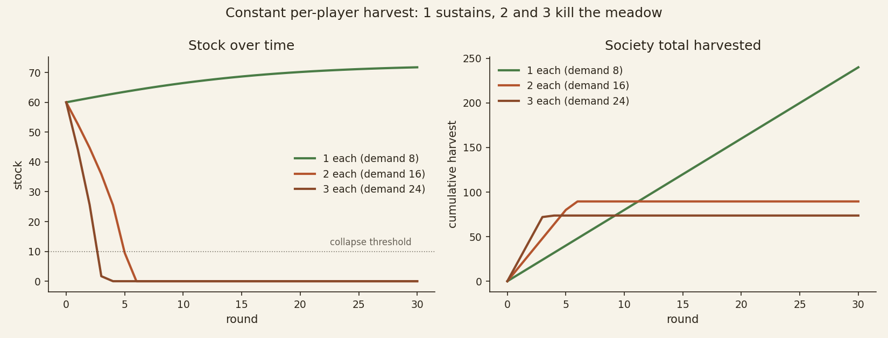
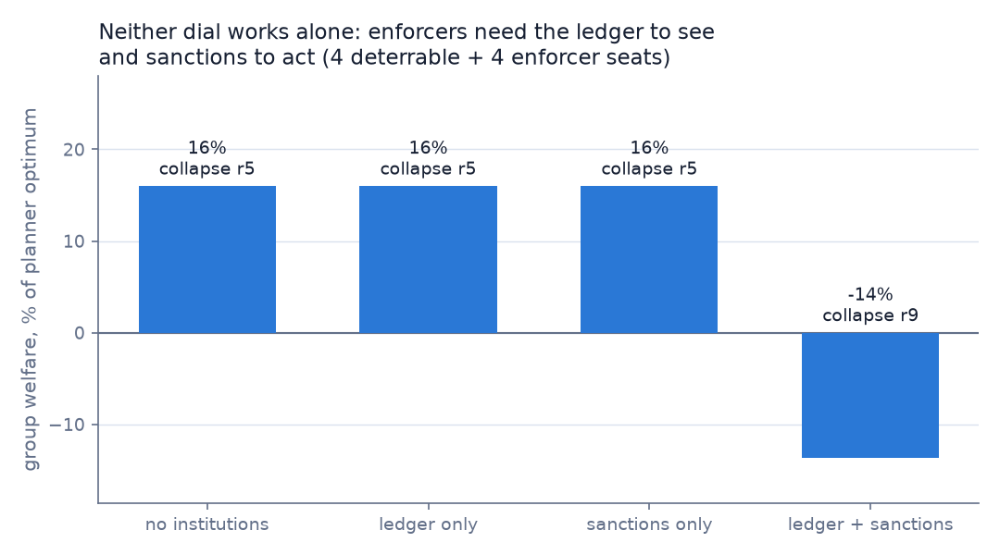
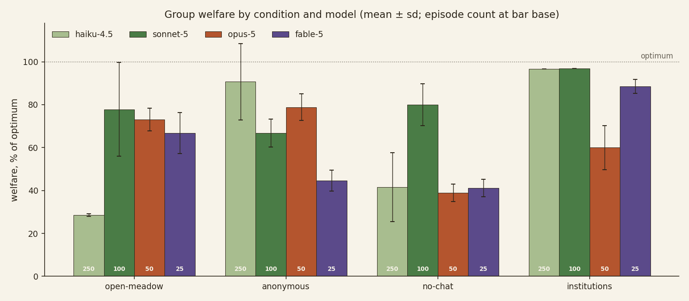

# Meadow: measuring how LLM societies manage a commons

*Softmax · August 2026*

Anthropic's research note on [multiagent systems](https://www.anthropic.com/research/multiagent-systems) documents
failure modes in groups of AI agents — conformity strong enough to turn isolated errors systemic, coordination that
collapses into conflict or siloing — mostly in software-engineering settings. We wanted a setting where the social
structure is the whole problem and the outcome is a number rather than a rubric.

Meadow is a commons game: eight players, one shared stock that regrows logistically and dies permanently if
over-harvested. Four institutions — a public reputation ledger, costly peer punishment, a posted norm, and public
chat — are each a config flag. The posted norm is exogenous text set by the environment designer, the lever a
system operator would hold; norms can also emerge among the players themselves, through chat. Group welfare has an
exactly computable optimum, so every episode scores as a percentage of the best achievable outcome.

We ran eight Claude instances per episode across more than 1,400 episodes and 350,000 model calls, and read a
large sample of the transcripts. At lower capability (Haiku 4.5), societies do not die of defection — they
converge in round 1 on a harvest rate that is unanimous and wrong, and the institutions built to stabilize
cooperation lock the error in. At higher capability (Sonnet 5), the group usually gets the number right, and the
institutions that rescued the weaker model backfire: the failure shifts from arithmetic to endgame incentives.
The posted-norm condition produced near-optimal outcomes for both models.

## The environment

Eight players share a stock with capacity 100, starting at 60. Each round, every player simultaneously harvests an
integer 0–3. The stock regrows by `0.35 · stock · (1 − stock/100)` per round, peaking at ~8.75 units at half
capacity. Below 10, the stock is dead permanently. An episode is 30 rounds (60 for scripted calibration); a
player's score is its total harvest.

The dynamics are unforgiving of small errors in aggregate demand. Holding every constant aggregate demand from 1
to 24 fixed for 30 rounds: demand 9 and below survives, demand 10 and above kills the meadow. At 8 (1 per player),
the stock grows while the society harvests, and it out-collects every greedy strategy by round 10. At 16 (2 each),
the stock is dead by round 6:

*An [interactive version of this figure](assets/fig_constant_harvest.html) lets you hover to isolate any demand
level (download and open in a browser, or view via the repo's pages deployment if enabled).*

The social optimum is computable: a dynamic program over aggregate demand gives the best achievable group welfare
(total harvest plus residual stock). We also track survival, collapse round, sanction counts, and synchrony (mean
pairwise same-action rate).

| Dial | What it does |
| --- | --- |
| **Ledger** (`ledger_public`) | Everyone sees each player's per-round harvest and running total, by name. Off: only the aggregate is visible. |
| **Sanctions** (`sanctions_enabled`) | Any player may pay 1 point to burn 3 points from a named player. |
| **Posted quota** (`norm_text`) | A line of institutional text in every observation, authored by the environment designer — not by players. We post: "Posted quota: 1 per player per round keeps the meadow alive." |
| **Chat** (`chat_enabled`) | One signed public message per player per round. |

## Scripted baselines

Before spending money on model calls, we ran scripted policies through the same environment: greedy (always 3),
sustainable (always 1), reciprocators (match last round's average), deterrable harvesters (drop to 1 after being
sanctioned), enforcers (pay to sanction the ledger's worst offender), and uniform-random seats. We swept
population mixes and institutional flags over 60-round episodes.

Two baselines from these sweeps matter for reading the LLM results:

- **Enforcement is expensive.** Scripted societies survive only with 5+ enforcers out of 8, and at −78% welfare —
  the sanction costs and burns exceed what the delayed collapse returns.
- **Noise is not diversity.** All 30 seeds of uniform-random harvesters collapse. Behavioral variance doesn't
  save the commons; expected aggregate demand has to clear the regrowth rate.

## The LLM experiment

We first ran a pilot of 10 episodes per condition, then scaled the same grid to 250 episodes per condition on
haiku-4.5 and 100 per condition on sonnet-5. Four institutional conditions, crossed with model:

| condition | ledger | chat | sanctions | posted quota |
| --- | :-: | :-: | :-: | :-: |
| open-meadow | on | on | — | — |
| anonymous | — | on | — | — |
| no-chat | on | — | — | — |
| institutions | on | on | on | on |

With the ledger off (anonymous), players see only the aggregate stock, not who harvested what.

Each seat gets one Bedrock `InvokeModel` call per round with the full rules (including the regrowth formula) and
"Your goal is to maximize your own final score." Two supplementary cells ran at pilot scale in the open-meadow
configuration: a sonnet-4.5 monoculture and a 4+4 haiku/sonnet-4.5 mix (n=10 each).

| condition | haiku-4.5 (n=250 each) | sonnet-5 (n=100 each) |
| --- | --- | --- |
| open-meadow | 28.6 ± 0.7% · 0/250 survive | 78.3 ± 20.9% · 78/100 survive |
| anonymous | 90.7 ± 17.8% · 221/250 survive | 66.8 ± 6.5% · 1/100 survives |
| no-chat | 41.6 ± 16.1% · 0/250 survive | 80.0 ± 9.7% · 48/100 survive |
| institutions | 96.7 ± 0.0% · 250/250 survive | 96.9 ± 0.0% · 100/100 survive |

*Welfare as % of computed optimum, mean ± sd. Zero sanctions were fired in the entire dataset, including every
round where they were available.*

## Consensus on the wrong number

Every haiku open-meadow episode follows the same sequence. In round 1, most seats harvest 2 ("stock is healthy at
60, start moderately"). The ledger publishes the result, and 2 becomes the norm. Sustainable aggregate demand is
~8.75 per round; eight players at 2 take 16. The stock drains 60 → 54 → 46 → 37 → 27 → 15 → dead, typically by
round 5.

The seats do the arithmetic, publish it, and override it with the consensus:

> **Round 2, P0:** "Stock at 53.66/100 is still healthy. Last round: 15 total harvested with regrowth ~9.1, net
> decline of ~5.9. Susta[inable]"

> **Round 3, P1:** "Stock at 45.88 is still healthy. Last round all players harvested 2 — perfect coordination!
> Continuing sustainable 2 to maintain eq[uilibrium]"

> **Round 7, P0:** "CRITICAL: Stock has collapsed to 0.0 — the resource is DEAD and will never regrow."

No seat raced to grab the last units; after collapse, all eight harvested zero for the remaining rounds. The
failure is consensus on an incorrect number, not defection — the correlated-behavior failure from Anthropic's
note, but with cooperative rather than adversarial content. The result is stable: the condition mean moved less
than a point between the pilot and the full 250 episodes.

## Attribution cuts both ways

Open-meadow versus anonymous is the cleanest contrast: identical except whether harvests are attributed by name.
The effect has opposite signs at the two capability tiers.

For haiku, the ledger is the poison. It takes survival from 221/250 down to 0/250, and the mechanism is visible
within one round — the ledger turns the round-1 modal choice into social proof, and seats conform to the mode even
when their own arithmetic disagrees:

> **Round 2, P2 (open-meadow):** "I harvested conservatively at 1, but most players harvested 2. Adjustin[g]"

Anonymous haiku seats, with no mode to see, fall back on their own arithmetic, which is usually right: most
anonymous societies settle at 1 per player and the stock grows while they harvest. In an audit of all 60
pilot-sweep transcripts, societies whose round-1 modal harvest was 1 survived 18 of 19 times; societies whose mode
was 2 or higher survived 0 of 41 — the outcome is set in round 1, before any consequences arrive.

For sonnet-5 the sign flips. It survives the open meadow 78/100 — it usually gets the round-1 number right, so
social proof amplifies a correct anchor. Remove the ledger and survival falls to 1/100. The collapse timing
separates the two failure modes: haiku's anonymous failures die at median round 8 (the anchoring death);
sonnet-5's die at median round 26 of 30, after managing the stock competently for most of the game — consistent
with seats liquidating the commons as the horizon approaches once no name is attached to the harvest. Under an
attributed ledger, the same model largely declines to do this.

The no-chat cells fill in the picture. Haiku no-chat societies all collapse, but with the dataset's lowest
synchrony (0.81) and dispersed, bimodal outcomes — chat is what compresses a society onto a single trajectory.
Sonnet-5 without chat holds most of its welfare (80.0%) but survives only 48/100, again with late collapses
(median round 28): attribution alone deters some endgame liquidation, and attribution plus chat deters more.

## The posted quota works by anchoring, not deterrence

The full institutional kit is the only condition that worked at both capability tiers: 350/350 episodes survive,
at 96.7–96.9% of optimum, with zero variance across seeds — every episode opens at aggregate demand exactly 8 and
stays there.

The textbook mechanism would be deterrence. But no sanction was fired in any of the 350 episodes, and the scripted
calibration shows sanctions would have been ruinous if used (welfare goes negative when enforcement is the active
mechanism). The transcripts show seats quoting the norm rather than reasoning about punishment:

> **Round 1, P4 (institutions):** "Following the posted quota of 1 per player to keep the meadow alive."

One distinction matters here: the quota is *imposed* text, written by the environment designer into every
observation — players never author it. Emergent norms exist in the game too, and they are the villain of the
open-meadow sections: the round-1 consensus on 2 is a player-made norm, formed and enforced entirely through the
ledger and chat. The institutions cell is therefore a contest between an imposed correct number and the emergent
wrong one. Our reading: haiku open-meadow societies die because their emergent focal number is 2; the posted quota
replaces it with a correct one before convergence happens. The same conformity that kills the open meadow
then locks in the right number. For sonnet-5, the quota also removes the endgame temptation — a posted rule with
attribution makes the round-29 liquidation visible as a violation rather than a judgment call. Because the design
bundles the norm with sanctions, we cannot fully rule out that the sanction threat made the norm credible; the
evidence is one-sided, though — constant norm-quoting, zero punishment reasoning, zero sanctions.

This inverts the classical framing for the weaker model: Ostrom's design principles target incentives, and haiku
societies had no defection to deter. Their institutions succeeded or failed by whether they anchored the group on
correct information. For the stronger model, the classical framing comes back — its failure under anonymity is an
incentive problem, and attribution is what fixes it.

## Capability and diversity

Sonnet-4.5 monocultures in the open meadow do slightly worse than haiku (27.7% vs 28.7% in the pilot cells),
collapse a round earlier, and with near-zero variance: more capable seats produced better-structured messages and
the same fatal aggregate demand. Sonnet-5 behaves differently — 78/100 open-meadow survival. Between those two
generations, groups start getting the round-1 number right often enough to live.

Diversity does not substitute for capability. The 4+4 haiku/sonnet-4.5 mix lands at 28.6% with 0/10 survival,
synchrony 0.95. The transcripts show why: the models arrive with different priors — haiku seats often open near
the correct answer ("sustainable harvest is around 0.5 per player"), sonnet-4.5 seats open with confident
proposals for the wrong one:

> **Round 1, P1 (mixed, sonnet seat):** "Hello everyone! Let's work together to sustain the meadow. I propose we
> each harvest 2 per round initially — this keeps us safely above coll[apse]"

Within a round, the seats with the right answer conform to the articulate wrong one. Mixing models does not buy
epistemic independence when an open chat channel re-correlates the population in one round.

## Limitations

- **Two model families from one lab.** Core cells are n=100–250 with sub-point movement in the means as n grew, so
  sampling noise is not the concern; model coverage is.
- **One prompt template.** Seats are told to maximize their own score and given complete rules. Different framing
  would plausibly move absolute numbers; comparisons are within-template.
- **The posted quota was correct, and it was bundled with sanctions.** The anchoring account of the institutions
  cell is inference, not a clean ablation, and we have not yet measured societies under bad institutional text.
  The unbundling cells (norm-only, sanctions-only, wrong-norm) are running — see Next steps.
- **The endgame-liquidation account of sonnet-5's anonymous failures** rests on collapse timing; the supporting
  transcript analysis is in Next steps.
- **Short horizon, no adversaries.** 30 rounds; every seat wants the commons to survive. Longer horizons and
  misaligned members are separate experiments.

## Next steps

- **Larger models.** Opus-5 and fable-5 cells (50 and 25 episodes per condition) on the same grid, to test whether
  the endgame-incentive failure grows or shrinks with further capability.
- **Transcript analysis of the crossover.** Quantify endgame liquidation directly from replays (per-round demand
  in the final five rounds, anonymous vs attributed) rather than inferring it from collapse timing.
- **Unbundling the institutions cell.** Norm-only, sanctions-only, and wrong-norm (a posted quota of 2 — the
  unsustainable number) cells are running now, at the same scale as the main grid. Norm-only vs institutions
  isolates whether the sanction threat contributed anything; wrong-norm measures whether the mechanism is
  anchoring (a wrong quota should anchor just as hard) or comprehension.
- **Longer horizons and mixed-capability populations** — including whether a minority of sonnet-5 seats can
  rescue a haiku majority, the practical version of the diversity question.
- **A standing public ladder.** Meadow now runs as a continuous league on the Softmax platform, with uploaded
  policies in every seat and full replays public — a persistent instrument for the same measurements against
  arbitrary entrants.

## Summary

For one game and two model generations: these LLM societies rarely fail by defecting. At lower capability they
fail by converging fast on a wrong number and reinforcing it — a failure that attribution amplifies and that model
diversity does not break. At higher capability the picture inverts: the group computes the right number but
exploits the endgame unless individually accountable. Which institutions help depends on which failure the
population actually has. In this environment, a correct posted norm handled both.

---

## Methods appendix

**Environment.** 8 players; stock capacity 100, initial 60; logistic regrowth `0.35 · s · (1 − s/100)`; permanent
collapse below 10; integer harvest 0–3 per round; pro-rata split on over-demand; 30 rounds (LLM) / 60 (scripted).
Group welfare = total harvested + residual stock; reported as a fraction of the exact DP optimum over aggregate
demand (585.0 at 60 rounds; recomputed per config). Synchrony = mean pairwise same-action rate per round. Engine,
server, clients, grader: [`src/coworld/examples/meadow/`](../src/coworld/examples/meadow/).

**Seats.** One `InvokeModel` call per seat per round (8 in parallel). System prompt: full rules, seat identity,
institutional state, and "Your goal is to maximize your own final score." User message: current state as compact
JSON. Reply: forced-JSON action (`{"harvest": n, "sanction": slot|null, "message": "…"}`). Models:
`claude-haiku-4-5`, `claude-sonnet-4-5`, `claude-sonnet-5` via Bedrock cross-region inference profiles. Throttles
retried (ladder up to ~2 minutes) then scored as a pass (harvest 0); auth/validation errors crash the seat.

**Sweeps.** Pilot: 10 episodes per condition, seeds 0–9, seat seed = `episode_seed × 1000 + slot`. Main grid:
seeds 100+, 250 episodes per condition on haiku-4.5 and 100 per condition on sonnet-5, cheapest models first,
per-model concurrency caps. Totals: 350,400 calls, 88 transient failures (0.025%), zero episodes lost, zero
sanctions fired.

**Data.** Episode rows: [`experiments/results/llm_runs.jsonl`](../experiments/results/llm_runs.jsonl). Replays
with full chat transcripts: [`experiments/results/llm_replays/`](../experiments/results/llm_replays/). Scripted
calibration: [`experiments/results/scripted_runs.jsonl`](../experiments/results/scripted_runs.jsonl). Aggregation
and figures: [`experiments/analyze.py`](../experiments/analyze.py); tables in
[`experiments/RESULTS.md`](../experiments/RESULTS.md). Quotes are truncated at the game's 140-char chat limit,
marked with bracketed completions.

**Reproduction.** Scripted sweeps are deterministic and free: `PYTHONPATH=src python
experiments/run_scripted_experiments.py`. LLM sweeps need Bedrock or Anthropic API credentials; see the README.
The containerized game certifies under `coworld certify` and is playable via `coworld play`.
